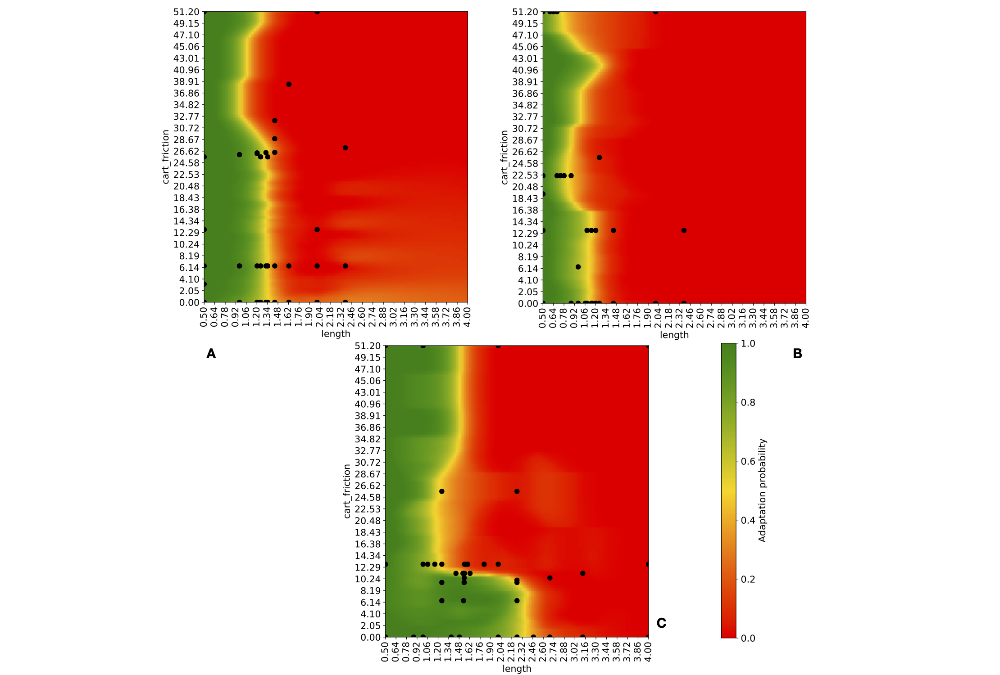

# Testing the Plasticity of Reinforcement Learning Based Systems
Source code and data for the [paper](https://github.com/testingautomated-usi/rl-plasticity-experiments/blob/main/testing-the-plasticity-of-reinforcement-learning-based-systems.pdf) "Testing the Plasticity of Reinforcement Learning Based Systems".

The approach generates the map below:



The figure shows the adaptation heatmaps of `PPO` (A), `SAC` (B) and `DQN` (C) in the `CartPole` environment when only the `length` (*x* axis) and `cartfriction` (*y* axis) parameters are considered. The ranges of these two parameters are the same for each DRL algorithm and the colors in each heatmap indicate the adaptation probability, as shown by the color bar on the bottom right corner of the figure. The adaptation frontier is the yellow continuous line between the green (adaptation successful) and the red (adaptation failed) regions of the heatmap, while the black dots indicate the search points sampled by the search procedure of AlphaTest. From the maps we can see that the parameter `length` is more critical in terms of adaptation capabilities than the `cartfriction` parameter, for all the algorithms. In particular, no DRL algorithm adapted when `length = 4.0`, although `DQN` (C) seems to be the best at tolerating the increase of such parameter, but all DRL algorithms adapted when `cartfriction = 51.20`. The adaptation heatmaps are easily interpretable by developers, as they show the regions of the parameter space where the adaptation frontier lies and where we can expect a certain algorithm to successfully adapt or not when the initial conditions of the environment change.

## 1. Installation

To install the dependencies to run this project (we currently support MacOS and Ubuntu):
1. Download and install [Anaconda](https://www.anaconda.com/)
2. Create directory workspace in your home directory and move there: `mkdir ~/workspace && cd ~/workspace`
3. Clone this repository: `git clone https://github.com/testingautomated-usi/rl-plasticity-experiments`
4. Create the environment with the python dependencies: `conda env create -f rl-plasticity-experiments.yml`

## 2. Run an experiment

To run an experiment with alphatest type the following commands:

1. Move to the source code directory: `cd ~/workspace/rl-plasticity-experiments/src`
2. Activate the python environment: `conda activate rl-plasticity-experiments`
3. Run the experiment:
``` sh
python experiments.py --algo_name ppo2 \
  --env_name CartPole-v1 \
  --num_iterations 13 \
  --param_names length,cart_friction \
  --runs_for_probability_estimation 3 \
  --num_search_iterations 1 \
  --logging_level INFO \
  --search_type alphatest
```
          
The previous command runs alphatest to test the plasticity of the PPO algorithm in the environment CartPole-v1 varying only two parameters of this environment, i.e. length and cart_friction. The number of repetitions is 1 (`--num_search_iterations 1`) and the number of runs for probability estimation is 3. If enough CPU cores are available such runs are carried out in parallel.

The experiment takes about 20 minutes on an 8-core machine and it creates a directory structure `alphatest/CartPole-v1/ppo2/n_iterations_length_cart_friction_8_0` in the root of the project. In the directory there are artifacts of the experiment, including the models for each continual learning run, the frontier pairs found, the search points sampled and the executions skipped due to the dominance analysis.

The directory [scripts](https://github.com/testingautomated-usi/rl-plasticity-experiments/tree/main/scripts) contains the scripts for reproducing the experiments reported in the paper. There is a directory for running [alphatest](https://github.com/testingautomated-usi/rl-plasticity-experiments/tree/main/scripts/alphatest) experiments and one for running [random](https://github.com/testingautomated-usi/rl-plasticity-experiments/tree/main/scripts/random) experiments. Moreover, the scripts are divided by environment. For example the previous python command was taken from the [cartpole](https://github.com/testingautomated-usi/rl-plasticity-experiments/blob/main/scripts/alphatest/CartPole-v1/cartpole_ppo_length_cart_friction.sh) directory of alphatest. 

To run alphatest for 5 repetitions in the CartPole-v1 environment for the PPO algorithm do the following steps:

1. Move to the root directory of the project: `cd ~/workspace/rl-plasticity-experiments`
2. Activate the python environment: `conda activate rl-plasticity-experiments`
3. Run the experiment: `source scripts/alphatest/CartPole-v1/cartpole_ppo_length_cart_friction.sh`

The 5 repetitions should take about 2 hours.

## 3. Compute the volume and build the heatmaps

Assuming that the directory `alphatest/CartPole-v1/ppo2/n_iterations_length_cart_friction_8_0` is present in the root of the project, i.e. at least one repetition of alphatest is completed.

To compute the adaptation and anti-regression volumes and the heatmaps:

1. Move to the source code directory: `cd ~/workspace/rl-plasticity-experiments/src`
2. Activate the python environment: `conda activate rl-plasticity-experiments`
3. Compute the volume:
``` sh
python analyze_volume_results.py --dir ~/workspace/rl-plasticity-experiments/alphatest/CartPole-v1/ppo2 \
				--algo_name ppo2 \
				--grid_granularity_percentage_of_range 1.0 \
				--env_name CartPole-v1 \
				--plot_file_path ~/workspace/rl-plasticity-experiments/alphatest/CartPole-v1/ppo2 \
				--param_names length,cart_friction \
				--smooth 2.0 \
				--plot_only_approximated \
				--max_points_x 50 \
				--max_points_y 50 \
				--regression_probability \
				--logging_level INFO
```

The previous command should produce a txt file called `analyze_volume_results_adapt_regress_probability_g_1.0.txt` in `alphatest/CartPole-v1/ppo2/n_iterations_length_cart_friction_8_0` where at the end it is written the adapation volume and the anti-regression volume (it is called regression volume in the txt file for brevity). In the same directory there are two pdf files called `heatmap_adaptation_probability_iteration_g_1.0_0.pdf` and `heatmap_regression_probability_iteration_g_1.0_0.pdf` for the adaptation probability and regression probability respectively. The adaptation probability heatmap is red where the algorithm did not adapt successfully and it is green otherwise; for the regression heatmap the opposite holds and the gray region is where it is not defined. The black points are the search points sampled during the search phase.

## 4. Data
The results of the experiments for all environments (i.e. CartPole, Pendulum, MountainCar, Acrobot) all RL algorithms (i.e. PPO, SAC, DQN) and all search methods (i.e. alphatest and random) are available for download [at this link](https://drive.switch.ch/index.php/s/yUzYGOiS1pN1t5b).

## 5. Citing the Project

To cite this repository in publications:

```bibtex
@article{DBLP:journals/tosem/BiagiolaT22,
  author       = {Matteo Biagiola and
                  Paolo Tonella},
  title        = {Testing the Plasticity of Reinforcement Learning-based Systems},
  journal      = {{ACM} Trans. Softw. Eng. Methodol.},
  volume       = {31},
  number       = {4},
  pages        = {80:1--80:46},
  year         = {2022},
  url          = {https://doi.org/10.1145/3511701},
  doi          = {10.1145/3511701},
  timestamp    = {Mon, 28 Aug 2023 21:25:10 +0200},
  biburl       = {https://dblp.org/rec/journals/tosem/BiagiolaT22.bib},
  bibsource    = {dblp computer science bibliography, https://dblp.org}
}
```
